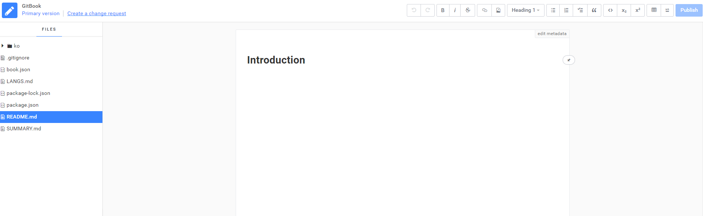
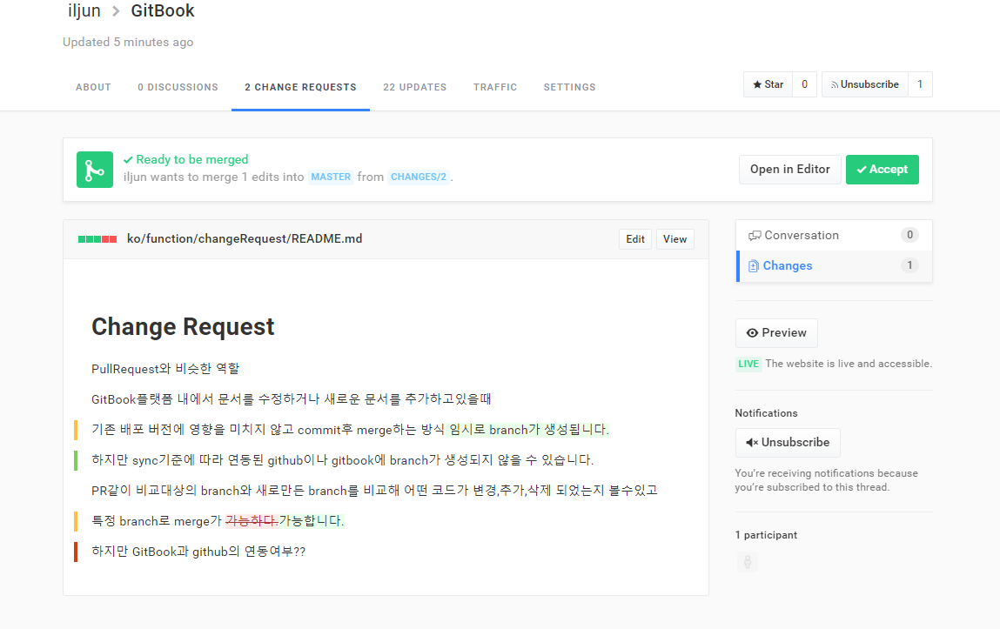

# Change Request

#### GitBook의 PullRequest

GitBook 플랫폼 내에서 문서를 수정하거나 새로운 문서를 추가하고 있을때

기존 배포 버전에 영향을 미치지 않고 commit 후 merge하는 방식

PR 같이 비교 대상의 branch와 새로 만든 branch를 비교해 어떤 코드가 변경, 추가, 삭제 되었는지 볼 수 있고 merge 가능합니다.

GitBook의 Edit 화면입니다.
원본을 직접 수정도 가능하며, 이미 존재하는 changeRequest를 불러와서 내용을 추가 및 수정도 가능합니다.
새로운 changeRequest를 생성할 때는 create A change request를 클릭후 문서 내용을 수정한 다음 publish 버튼을 클릭합니다.
publish 버튼은 실제 문서를 수정했다면 수정 내용을 바로 발행하고,
changeReqeust를 만들거나 수정했다면 changeRequest를 발행한다는 의미입니다.

생성된 changeRequest는 GitHub의 pullRequest처럼 문서의 변경사항을 추적할 수 있습니다.
또한 Accept 버튼으로 changeRequest를 만든 기존 문서와 merge도 가능합니다.
