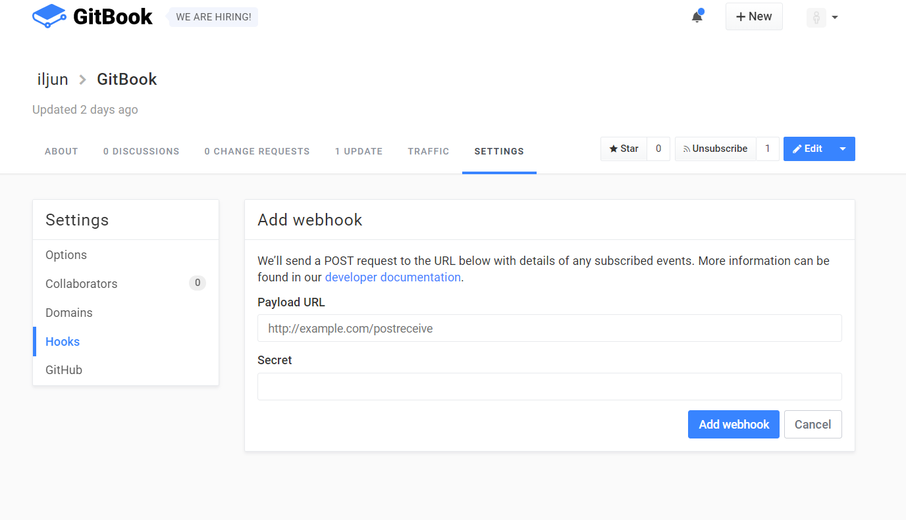

# WebHook 기능

gitbook.com에서 Webhook 기능을 설정할 수 있습니다.

아래와 같은 화면에서

특정한 이벤트 때 Webhook을 받을 URL을 설정 가능합니다.

또한 특정한 브랜치에 이벤트가 발생했을때만 Webhook 기능 활성화가 가능합니다.

특정한 이벤트란 4가지가 존재합니다.

| 이벤트   | 설명    |
|----------|---------|
| All   |   이벤트 발생 시 언제나 reqeust 전송   |
| Publish   |   특정한 branch에서 puslbish됐을 때 reqeust 전송  |
| thread     |  Discussion이 열리거나 닫혔을 때 또는 다시 열렸을 때 reqeuest전송 |
| thread_comment     |  Discussion이나 pullRequest에 comment가 달렸을 때 request전송   |

Webhook이 전송될때 HttpHeader에 포함되어 전송되는 값

Webhook은 post의 형태로 전달받습니다.

|   RequestHeader   |   설명  |
|----------|---------|
| X-GitBook-Event	Name     |   이벤트명   |
| X-GitBook-Signature   |   secret 키를 설정한 경우 HMAC 방식으로 인코딩되어 전송됩니다. |
| X-GitBook-Delivery  |  Request의 고유한 ID가 전송됩니다. |

### Webhook기능은 GitBook에 이벤트에 해당하는 전처리와 후처리 기능을 위해 사용하면 적절한 기능이라고 생각합니다.